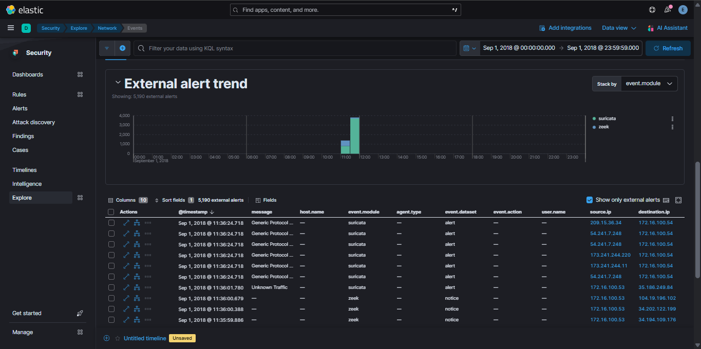
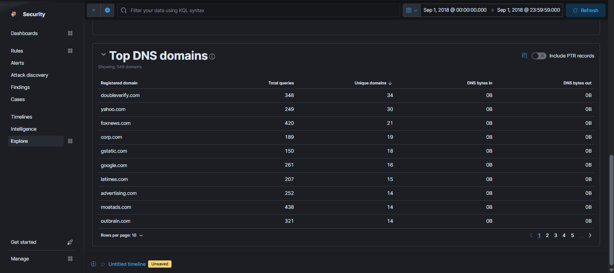
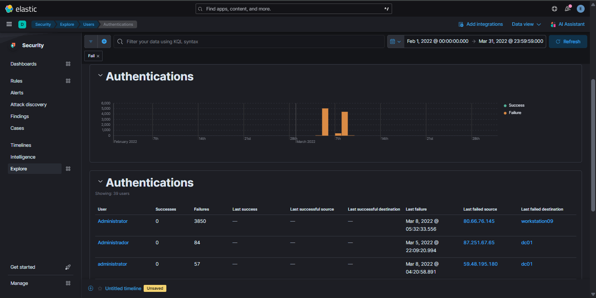

# Lab 7.2 - Security App: Explore

## 📋 Lab Overview
## 📸 Lab Screenshots







---

**Module:** Security Applications  
**Lab Section:** 7.2 - Explore  
**Objective:** Navigate and analyze security data using Elastic Security's Explore interface  
**Focus Areas:** Host analysis, network traffic investigation, DNS analysis, HTTP monitoring, user authentication tracking

**Completed:** October 11, 2025

---

## 🎯 Learning Objectives

This lab focused on building proficiency with the Elastic Security App's **Explore** section, which provides interactive overview pages for investigating security events across multiple data sources.

**Key Skills Practiced:**
- Navigating Elastic Security's Explore interface
- Analyzing host, network, and user activity
- Filtering and drilling down into security alerts
- Using time-based analysis for threat context
- Correlating data across multiple security tools (Suricata, Zeek)
- Identifying suspicious patterns in DNS and HTTP traffic

---

## 🔍 Investigation Process

### 1. Understanding the Explore Interface

**Discovery:**  
The Explore section serves as the central hub for security data analysis in Elastic Security. It provides comprehensive overview pages organized by:
- **Hosts** - System-level activity and endpoint security
- **Network** - Traffic patterns and network-based detections
- **Users** - Authentication events and user behavior
- **Alerts** - Security detections from various sources

**Why This Matters:**  
In a SOC environment, the Explore interface is your primary entry point for proactive threat hunting and initial triage of security events.

---

### 2. Host Analysis

**Objective:** Understand endpoint visibility in the environment

**What I Explored:**
- Reviewed the Hosts tab to view system information
- Examined hostnames, operating systems, and security event associations
- Analyzed host activity levels through visualizations

**Key Insight:**  
The Hosts page provides a quick overview of endpoint activity, allowing analysts to identify potentially compromised systems or unusual behavior patterns at the host level.

**Real-World Application:**  
During incident response, this view helps quickly identify which hosts are generating security events and may require deeper investigation.

---

### 3. Network Traffic Analysis - Day 1 Alerts

**Objective:** Analyze network-based security detections

**Investigation Steps:**

1. **Navigated to:** Explore → Network
2. **Adjusted timepicker to:** Day 1
3. **Filtered to:** Show only external alerts (Events tab)
4. **Observed:** Total number of alerts at bottom of page

**Finding:**  
Identified the volume of external alerts generated during Day 1, establishing a baseline for network-based detections.

**Analysis Technique:**  
Focusing on external alerts helps prioritize threats from outside the network perimeter, which often represent higher-risk activities (scanning, exploitation attempts, C2 communication).

---

### 4. Alert Source Identification - Suricata vs. Zeek

**Objective:** Determine which detection tool generated the most alerts

**Investigation Steps:**

1. **Examined:** External alert trend visualization
2. **Focused on:** `event.module` field
3. **Identified:** Suricata as the primary alert source

**Finding:**  
**Suricata** was responsible for the majority of alerts during the observed timeframe.

**Follow-up Analysis:**
- Filtered out Suricata alerts to isolate remaining detections
- Confirmed **Zeek** generated a smaller but distinct set of alerts

**Why This Matters:**  
Understanding which tools are generating alerts helps with:
- **Alert triage prioritization** - Different tools have different false positive rates
- **Detection coverage gaps** - If one tool is silent, it may indicate misconfiguration
- **Investigation context** - Suricata focuses on signatures, while Zeek provides protocol analysis

**Query Logic (Conceptual):**
```kql
// View all external alerts
event.category: "alert" AND network.direction: "external"

// Filter by detection tool
event.module: "suricata"
event.module: "zeek"
```

---

### 5. DNS Analysis - Most Queried Domain

**Objective:** Identify potentially suspicious or high-volume DNS activity

**Investigation Steps:**

1. **Navigated to:** Network → DNS tab (Day 1 timeframe)
2. **Analyzed:** Top 10 DNS Domain visualization
3. **Identified top domain:** `moatads.com`

**Finding:**  
**moatads.com** had the highest number of DNS queries during Day 1.

**Context Analysis:**  
- `moatads.com` is associated with advertising tracking and analytics
- High query volume could indicate:
  - Normal web browsing with ad-heavy sites
  - Potential ad-tracking infrastructure
  - Baseline for distinguishing legitimate vs. malicious DNS patterns

**Threat Hunting Consideration:**  
While this domain appears benign, the methodology applies to identifying:
- Command & Control (C2) beaconing via DNS
- DNS tunneling for data exfiltration
- Domains with abnormally high query counts

**Query Logic (Conceptual):**
```kql
// Top DNS queries by domain
event.category: "network" AND network.protocol: "dns"
| stats count() by dns.question.name
| sort count desc
| limit 10
```

---

### 6. HTTP Traffic Analysis - Most Requested Path

**Objective:** Analyze HTTP request patterns for suspicious activity

**Investigation Steps:**

1. **Examined:** HTTP section visualization
2. **Reviewed:** Domains and request counts
3. **Identified:** Most requested URL path: `/ping`

**Finding:**  
The domain with the highest HTTP request count had the path **/ping** as its most frequently accessed endpoint.

**Analysis:**  
- `/ping` endpoints are commonly used for health checks and monitoring
- High frequency could indicate:
  - Legitimate application monitoring
  - Load balancer health checks
  - Potential reconnaissance or service enumeration

**Security Implications:**  
Understanding normal HTTP patterns helps identify:
- Web application attacks (SQL injection, XSS attempts)
- Scanning/enumeration activities
- Data exfiltration via HTTP
- C2 communication disguised as web traffic

**Query Logic (Conceptual):**
```kql
// Top HTTP request paths
event.category: "network" AND network.protocol: "http"
| stats count() by url.path, destination.domain
| sort count desc
```

---

### 7. User Authentication Analysis - Failed Login Detection

**Objective:** Identify potential brute force attacks or compromised credentials

**Investigation Steps:**

1. **Navigated to:** Explore → Users
2. **Adjusted timepicker to:** BLISTER (specific time range)
3. **Examined:** Authentication visualization
4. **Filtered for:** Failed authentication attempts
5. **Identified:** User with most failed authentications

**Finding:**  
One specific user account had significantly more failed authentication attempts than others during the BLISTER timeframe.

**Security Analysis:**  
High failed authentication counts can indicate:
- **Brute force attack** - Automated password guessing
- **Credential stuffing** - Testing leaked credentials
- **User behavior issues** - Forgotten passwords (less likely if extreme volume)
- **Compromised account** - Attacker attempting to regain access

**Investigation Next Steps (Real-World):**
1. Check source IPs of failed attempts (single vs. distributed)
2. Review time distribution (rapid succession vs. sporadic)
3. Determine if any attempts succeeded
4. Correlate with other user activity (lateral movement, privilege escalation)
5. Check for account lockouts or security alerts

**Query Logic (Conceptual):**
```kql
// Failed authentication attempts by user
event.category: "authentication" AND event.outcome: "failure"
| stats count() by user.name, source.ip
| sort count desc
```

**Real-World Response:**
- Immediate: Verify account hasn't been compromised
- Short-term: Reset credentials, enable MFA if not present
- Long-term: Implement account lockout policies, monitor for similar patterns

---

## 💡 Key Takeaways

### Technical Skills Developed

1. **Navigation Proficiency**
   - Mastered the Explore interface layout
   - Understood how different data views interconnect

2. **Time-Based Analysis**
   - Used timepickers effectively to focus investigations
   - Recognized the importance of temporal context in security events

3. **Data Correlation**
   - Compared outputs from multiple detection tools (Suricata, Zeek)
   - Cross-referenced network, DNS, HTTP, and authentication data

4. **Pattern Recognition**
   - Identified high-volume indicators (DNS queries, HTTP requests, failed logins)
   - Distinguished between normal baseline activity and potential threats

### Analytical Approach

**What Worked:**
- Starting broad (overview pages) then drilling down into specifics
- Using visualizations to quickly identify outliers
- Filtering data systematically to isolate relevant events

**Methodology:**
- Always understand the context before diving into details
- Use time-based filtering to focus on specific incident windows
- Cross-reference multiple data sources for complete picture

### Real-World SOC Applications

**This lab directly applies to:**
- **Threat Hunting:** Using Explore to proactively search for suspicious patterns
- **Incident Triage:** Quickly assessing alert volumes and sources
- **Investigation:** Drilling into specific hosts, users, or network activity
- **Baseline Establishment:** Understanding normal vs. anomalous behavior

**Common SOC Workflows Practiced:**
1. Start with high-level overview (Explore)
2. Identify anomalies or high-priority alerts
3. Filter and narrow scope
4. Correlate across multiple data types
5. Document findings for further investigation

---

## 🎯 CTFd Challenge Questions & Solutions

### Challenge 1: Interactive (50 pts)
**Question:** The Elastic Security App nests interactive, comprehensive overview pages under what section of the application?

**Answer:** `Explore`

**Method:** Understanding of Elastic Security App structure

**Context:** The Explore section contains subpages like Hosts, Network, and Users—each offering summarized and interactive views of telemetry data.

---

### Challenge 2: Hosts (50 pts)
**Question:** Navigate to Explore → Hosts. Make sure the timepicker is on BLISTER and no filters pinned. How many unique source IPs were seen?

**Answer:** `3700`

**Method:** Hosts page → BLISTER timeframe → Hover over visualization for count

**Analysis:** 3,700 unique source IPs represents significant network diversity. In a real environment, this helps identify the scope of network activity and potential lateral movement indicators. A sudden spike in unique source IPs could indicate scanning activity or compromised systems reaching out to C2 infrastructure.

---

### Challenge 3: What is making the most noise? (50 pts)
**Question:** Click on the Events view and change Stack by to `event.dataset`. What dataset is responsible for the largest amount of events?

**Answer:** `system.security`

**Method:** Events view → Stack by `event.dataset` → Identify highest volume

**Context:** This indicates most logs originated from the system's security module, showing authentication or process monitoring data. High volume here is normal for Windows environments with detailed security auditing enabled.

---

### Challenge 4: Network (50 pts)
**Question:** Navigate to the Network page and select Day 1 on the timepicker. Select Show only external alerts on the Events tab. How many alerts were observed?

**Answer:** `5190`

**Method:** Network page → Day 1 → Events tab → "Show only external alerts" → Read document count at bottom

**Security Significance:** 5,190 external alerts in a single day represents substantial detection activity. External alerts represent threats from outside the network perimeter—these are typically higher priority for investigation. This volume requires effective triage and prioritization strategies to avoid alert fatigue.

---

### Challenge 5: Which tool? (50 pts)
**Question:** According to this visualization, which tool is responsible for the bulk of these alerts?

**Answer:** `Suricata`

**Method:** External Alert Trend visualization → Analyze `event.module` field distribution

**Context:** Suricata is a signature-based IDS/IPS that excels at detecting known threats. High alert volume from Suricata indicates active signature matching against network traffic.

---

### Challenge 6: Dynamic (50 pts)
**Question:** Filter out Suricata. Now how many alerts have been created by Zeek?

**Answer:** `694`

**Method:** Apply filter to exclude Suricata → Read total from document count

**Analysis:** With 694 alerts compared to Suricata's ~4,500, Zeek represents approximately 13% of total detections. Zeek (formerly Bro) provides protocol analysis and behavioral detection. This comparison shows different detection methodologies—Suricata's signature-based approach catches more known threats, while Zeek's anomaly detection identifies protocol violations and unusual behaviors that might evade signatures.

---

### Challenge 7: Top Domain (50 pts)
**Question:** Make sure to remove any filters and set the timepicker to Day 1. Click on DNS. What is the most queried domain name?

**Answer:** `moatads.com`

**Method:** DNS tab → Day 1 timeframe → "Top 10 DNS Domain" visualization → Identify highest count

**Context:** moatads.com is an advertising/tracking domain. High query volume is expected in normal browsing but establishes a baseline for identifying malicious domains with similar patterns.

---

### Challenge 8: Walking the Path (50 pts)
**Question:** Clear any filter and navigate to the HTTP section. What is the value of the URL path for the domain with the highest number of requests?

**Answer:** `/ping`

**Method:** HTTP section → HTTP Requests visualization → Identify domain with highest count → Note URL path

**Analysis:** /ping endpoints are commonly used for health checks and monitoring. Understanding normal HTTP patterns helps identify web-based attacks or data exfiltration attempts.

---

### Challenge 9: But Is It Local? (50 pts)
**Question:** Navigate to Explore → Users. Make sure the timepicker is on BLISTER. Who is the user with the most failed authentications?

**Answer:** `Administrator`

**Method:** Users page → BLISTER timeframe → Authentications view → Filter for failures → Check user list

**Security Implications:** The **Administrator** account showing the highest failed authentication count is a critical security finding. This is a high-value target that attackers prioritize because:
- Administrator accounts have elevated privileges
- Successful compromise grants full system control
- Brute force attacks commonly target default/well-known accounts

**Real-World Response Actions:**
1. Immediate: Check if any authentication attempts succeeded after the failures
2. Analyze source IPs to determine if attacks are distributed or from single source
3. Review time distribution to identify automated attack patterns
4. Verify Administrator account hasn't been compromised
5. Implement account lockout policies if not present
6. Consider renaming Administrator account and enforcing MFA
7. Investigate any lateral movement if compromise occurred

---

## 📊 Challenge Summary

**Total Points:** 450 pts  
**Challenges Completed:** 9/9 ✅  
**Success Rate:** 100%

| # | Challenge Name | Points | Answer Type | Difficulty |
|---|----------------|--------|-------------|------------|
| 1 | Interactive | 50 | Interface knowledge | Easy |
| 2 | Hosts | 50 | Numeric count | Easy |
| 3 | What is making the most noise? | 50 | Dataset identification | Medium |
| 4 | Network | 50 | Numeric count | Easy |
| 5 | Which tool? | 50 | Tool identification | Easy |
| 6 | Dynamic | 50 | Numeric count | Medium |
| 7 | Top Domain | 50 | Domain name | Easy |
| 8 | Walking the Path | 50 | URL path | Easy |
| 9 | But Is It Local? | 50 | Username | Medium |

---

## 🔗 Related Security Concepts

**MITRE ATT&CK Techniques Relevant to This Lab:**
- **T1595** - Active Scanning (network reconnaissance)
- **T1071** - Application Layer Protocol (HTTP/DNS for C2)
- **T1110** - Brute Force (failed authentication attempts)
- **T1071.004** - DNS (command and control via DNS)

**Detection Categories:**
- Network-based intrusion detection (Suricata)
- Protocol analysis and anomaly detection (Zeek)
- Authentication monitoring
- Network traffic analysis

---

## 📚 Additional Notes

**Lab Environment:**
- Elastic Security SIEM platform
- Pre-loaded dataset with simulated security events
- Multiple data sources (network logs, authentication logs, DNS, HTTP)

**Tools Utilized:**
- Elastic Security App (Explore interface)
- Suricata (Network IDS)
- Zeek (Network analysis framework)

**Time Investment:**
Approximately 1-2 hours for complete lab exploration and challenge completion.

---

## 🚀 Next Steps

**Building on This Lab:**
- **Lab 7.3:** Detection Rules - Creating custom detection logic based on patterns discovered
- **Lab 7.4:** Alerts - Managing and triaging security alerts at scale  
- **Lab 7.5:** Timelines - Reconstructing event sequences for incident investigation

**Skills to Develop Further:**
- Writing custom KQL queries to automate these investigations
- Creating visualizations and dashboards for continuous monitoring
- Building detection rules based on identified suspicious patterns

---

**Lab Status:** ✅ Completed  
**Documentation Status:** ✅ Complete  
**Ready for:** Detection Rule Development (Lab 7.3)
